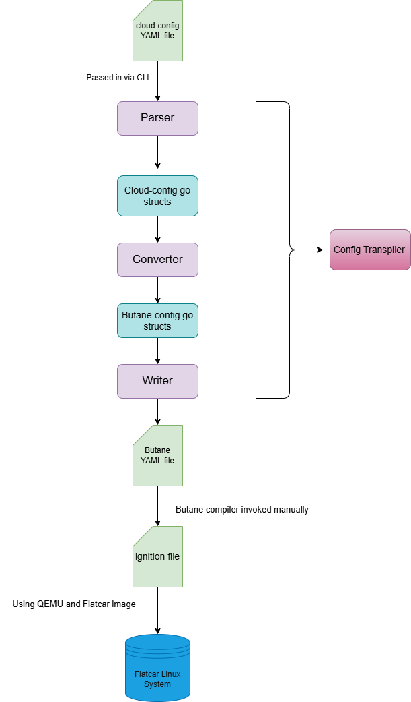
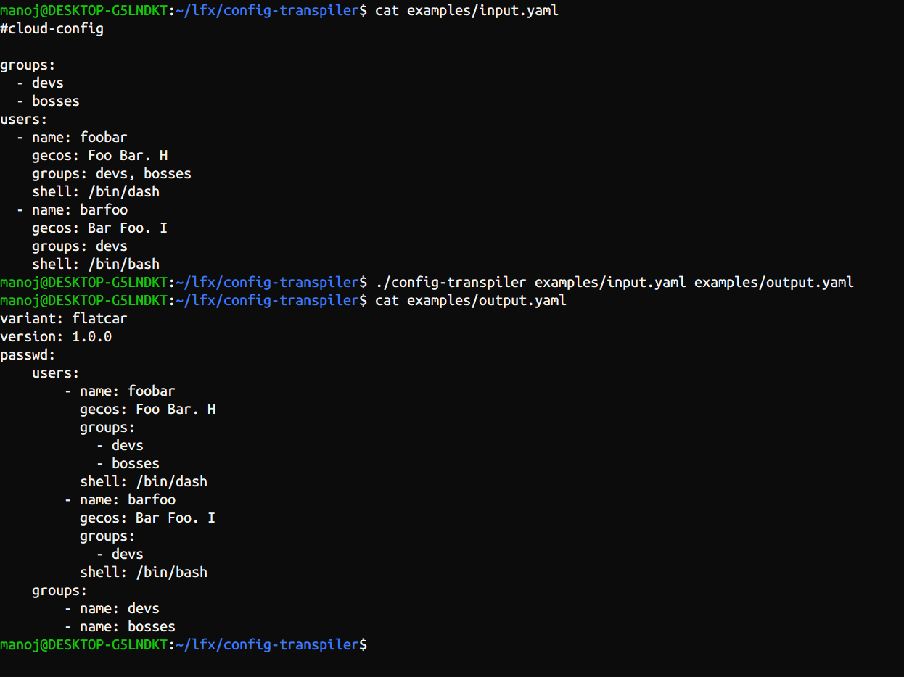
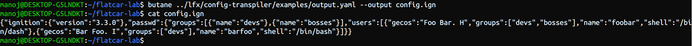
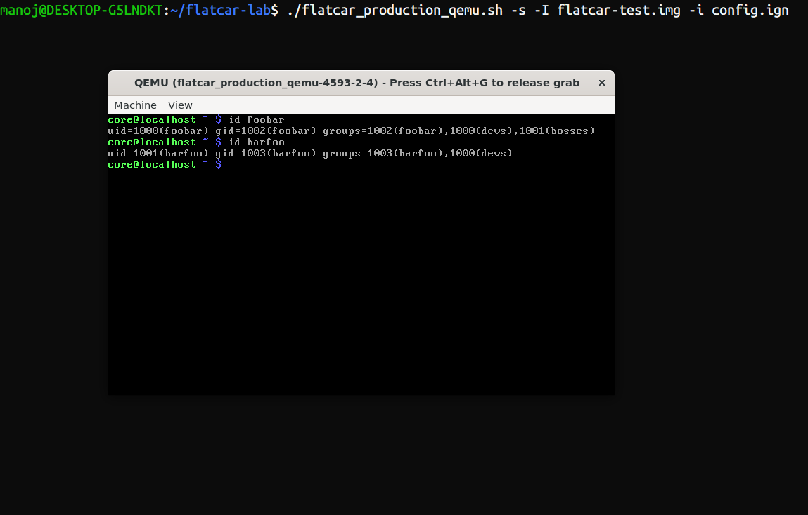

## Config Transpiler

A config transpiler written in Go that converts cloud-config YAML files
into Butane YAML files.

## Motivation

This repository is a prototype for the project named ```CNCF - Flatcar Container Linux:
Cloud-Init to Butane YAML config transpiler (2026 Term 3)``` which is under LFX 2026 fall term 
program.

## Architecture



After the work of the config transpiler, butane compiler can convert the output butane yaml file
into an ignition file which can then be used for provisioning of a Flatcar Linux machine.

## QEMU Validation

1) config-transpiler converts cloud-config YAML file from examples into a butane format YAML file
named ```output.yaml```



2) The output butane format YAML file is then used by the Butane compiler in another directory.



3) The ```config.ign``` is then used by QEMU for a Flatcar Image.



## Features supported

Since this is a prototype, only a small subset of the features needed are supported.
For more details : [Supported Features](./doc/supported-features.md)

## Example usage

Assume a cloud-config YAML file, that has the following contents:

```yaml
groups:
    - devs
    - bosses

users:
    - name: foobar
      gecos: Foo B. Bar
    - name: barfoo
      gecos: Bar B. Foo
```

It will be converted to:

```yaml
variant: flatcar
version: 1.0.0
passwd:
    groups:
        - devs
        - bosses
    users:
        - name: foobar
          gecos: Foo B. Bar  
        - name: barfoo
          gecos: Bar B. Foo 
```


## Using the CLI

```bash
./config-transpiler <input_file_name.yaml> <output_file_name.yaml>
```

## Next Steps

Checkout out the [Supported Features](./doc/supported-features.md) section for future plans.
To quickly run the CLI, use the pre-written config files in examples section by running:

```
./config-transpiler examples/input.yaml <output_filename>
```

